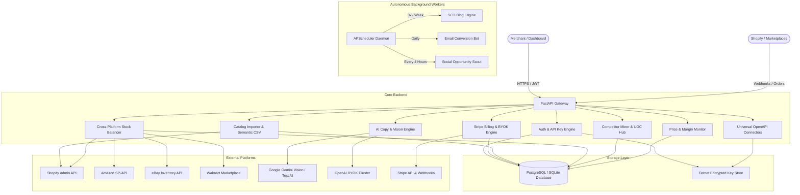
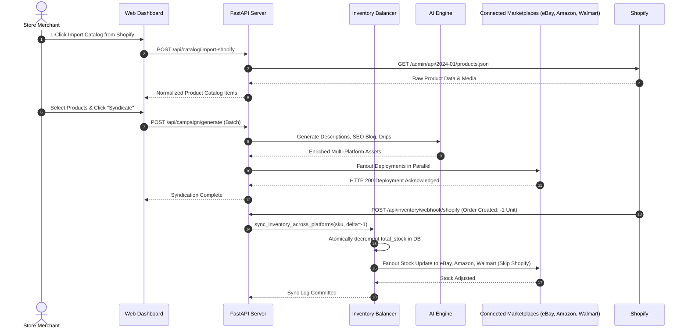

# KopyKat — Autonomous E-Commerce Operating System

[](https://github.com/thepros2014/kopykat/actions)
[](https://github.com/thepros2014/kopykat)
[](https://python.org)
[](https://fastapi.tiangolo.com)
[](https://stripe.com)
[](LICENSE)
[](tests/test_no_emojis.py)


KopyKat is a multi-channel e-commerce automation and marketing engine. It synchronizes catalogs across Shopify, Amazon, eBay, Walmart, and Temu, mines competitor 1-star reviews to generate high-converting counter-copy, balances cross-platform stock levels in real time to prevent overselling, and automates SEO blogs, email drips, and lead discovery.

---

## Architecture Overview

### 1. Component Diagram



---

### 2. Data Flow Diagram



---

### 3. Background Cron Job Schedules

```mermaid
gantt
    title Autonomous Background Worker Schedules
    dateFormat X
    axisFormat %H:%M

    section SEO Blog Bot
    Draft & Publish Store Article (Mon/Wed/Fri 09:00 UTC) :active, seo1, 0, 10
    
    section Conversion Drip Bot
    Process Day 1, 3, 7 User Nurture Sequences (Daily 10:00 UTC) :drip1, 10, 20

    section Social Opportunity Scout
    Scan Reddit & Social Discussions (Every 4 Hours) :scout1, 0, 5
    Scan Reddit & Social Discussions :scout2, 240, 245
    Scan Reddit & Social Discussions :scout3, 480, 485
    Scan Reddit & Social Discussions :scout4, 720, 725
```

---

## Module Map & Capabilities

| Module | Core Responsibility | Key Endpoints | Supported Channels |
|---|---|---|---|
| **Module 1: Competitor Review Miner** | Ingests 1-star competitor reviews to generate counter-copy, comparison tables, and ad angles. | `POST /api/competitor/mine-reviews` | Universal Copy |
| **Module 2: Inventory Balancer** | Real-time stock synchronization across platforms on order events to prevent overselling. | `POST /api/inventory/webhook/{platform}`, `GET /api/inventory` | Shopify, Amazon, eBay, Walmart, Temu |
| **Module 3: Review & UGC Drip Hub** | Generates 3-step post-purchase review sequences and classifies sentiment of customer feedback. | `POST /api/reviews/drip-templates`, `POST /api/reviews/submit` | Email / Storefront Webhooks |
| **Module 4: Price & Margin Monitor** | Unit economics engine tracking COGS, profit per unit, margin health, and competitor price shifts. | `POST /api/pricing/item`, `GET /api/pricing/items` | Catalog SKUs |
| **Module 5: Shopify Direct Import** | 1-click direct catalog fetch via Shopify Admin API without manual CSV exports. | `POST /api/catalog/import-shopify` | Shopify Admin REST |
| **BYOK Enterprise AI Infrastructure** | Megastore tier support for custom private OpenAI and Google Gemini API keys. | `POST /api/user/custom-ai-key` | OpenAI, Gemini |

---

## Pricing Tiers

- **Test Drive ($0 / mo):** 5 monthly campaigns, 1 connected platform of choice, core engine preview.
- **Boutique Store ($179.49 / mo):** 150 monthly campaigns, 2 connectors of choice, 1 automation feature (CSV or Auto-Sync), Review Miner.
- **Standard Store ($379.49 / mo):** 1,000 monthly campaigns, 10 connectors of choice, 2 automations (CSV + Vision AI), Universal Connectors.
- **Megastore Infrastructure ($9,639.63 / mo):** 2,500 monthly campaigns (using platform cloud) or **UNLIMITED** campaigns via Bring-Your-Own-Key (BYOK), all connectors and automations included, dedicated high-throughput cluster.

---

## Tech Stack

- **Backend:** Python 3.11, FastAPI, SQLAlchemy 2.0, Uvicorn, SlowAPI, Bleach, Pydantic V2
- **Database:** PostgreSQL / SQLite with Fernet credential encryption
- **AI Infrastructure:** Google Gemini (`gemini-flash-latest`), OpenAI GPT-4o
- **Billing:** Stripe Subscriptions, One-Time Packs, and Webhooks
- **Frontend:** Vanilla HTML5, CSS3, ES6 JavaScript (Zero dependencies, XSS-safe DOM)
- **CI / CD:** GitHub Actions (Pytest, Black, Flake8, Bandit)

---

## Documentation Links

- [API Authentication](docs/api/auth.md)
- [API Billing & BYOK](docs/api/billing.md)
- [API Content & Campaign Generation](docs/api/generation.md)
- [API Inventory Balancer](docs/api/inventory.md)
- [Technical Spec Sheet](docs/SPEC_SHEET.md)
- [Operator Tutorial](docs/TUTORIAL.md)
